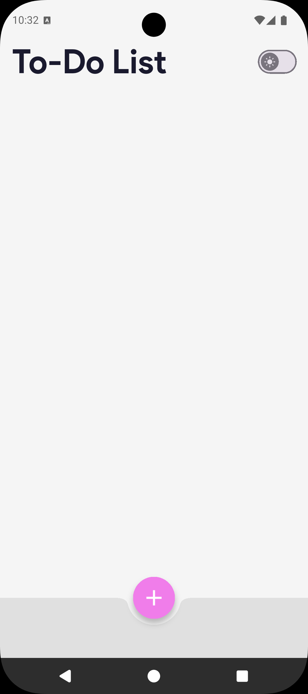

# **Fully-Featured To-Do App**

A beautiful, fully persistent To-Do list application built with Flutter. This project demonstrates a complete, professional-grade mobile app architecture, featuring advanced state management with Riverpod, local persistence with a Sembast database, and a dynamic, themeable UI.

## **📸 Demo & Screenshots**

This app features a fully switchable light/dark mode theme with vibrant, colorful accents to create an engaging user experience.

<table>
  <tr>
    <td align="center">
      
       
      <b>Home Screen</b>
    </td>
    <td align="center">
      
       
      <b>Home Screen Dark</b>
    </td>
    <td align="center">
      
       
      <b>Enter Task</b>
    </td>
  <tr>
    <td align="center">
      
       
      <b>See Task</b>
    </td>
    <td align="center">
      
       
      <b>Complete Task</b>
    </td>
    <td align="center">
      
       
      <b>Complete Task Dark</b>
    </td>
  </tr>
    <td align="center">
      
       
      <b>Demo</b>
    </td>
  <tr>
  </tr>
</table>

## **✨ Features**

* **Full CRUD Functionality:** Create, Read, Update (toggle status), and Delete tasks.
* **Persistent Local Storage:** All tasks and theme settings are saved on-device using the **Sembast NoSQL database**. Your list is always there, even after closing the app.
* **Advanced State Management:** Architected with **Riverpod**, featuring multiple providers (TodoListNotifier, ModeNotifier) for a clean, decoupled, and scalable state.
* **Dual Theming System:** A complete, switchable light & dark mode system built with a centralized ThemeData class.
* **Professional Polish:** Features a native splash screen and adaptive app icons.
* **Modern & Reactive UI:** Built with ListView.builder for performance and a modern UI featuring a docked FloatingActionButton and a modal bottom sheet for adding tasks.

## **🛠️ Technologies & Packages Used**

* **Core:** Flutter, Dart
* **State Management:** flutter_riverpod
* **Database:** sembast, path_provider, path
* **Dev Tools & Assets:** flutter_launcher_icons, flutter_native_splash

## **🚀 Architectural Highlights**

This project was built to demonstrate a robust, professional-grade Flutter architecture.

1. **Sembast Database & Persistence Layer**
    * A **Singleton pattern** (SembastDatabase class) is used to ensure a single, safe, and globally accessible database connection throughout the app's lifecycle.
    * The database is initialized asynchronously in main.dart *before* the app runs, guaranteeing it's available to all widgets from the start.
    * Data models (Todo) include toJson and fromJson methods to handle serialization, translating Dart objects into a storable JSON format.
2. **State Management with Riverpod**
    * A **multi-provider** approach cleanly separates concerns. TodoListNotifier handles the core CRUD logic for tasks, while ModeNotifier independently manages the UI theme.
    * Notifiers interact directly with the Sembast database, acting as a repository layer that abstracts the data source from the UI.
    * The UI is built with ConsumerStatefulWidget to allow for initial data loading in initState, and uses ref.watch to reactively rebuild when the state changes and ref.read to safely call methods.
3. **Centralized Theming System**
    * A single AppTheme class in themes.dart defines all colors, text styles, and component themes (CardThemeData, AppBarTheme, etc.) for both light and dark modes.
    * The root MaterialApp widget watches the modeNotifierProvider to dynamically switch between AppTheme.lightMode and AppTheme.darkMode, ensuring the entire app's look and feel is consistent and easy to manage from one file.

## **📈 Future Improvements**

* **Cloud Sync:** Integrate with a backend service like Firebase Firestore to sync the to-do list across multiple devices in real-time.
* **Task Categories:** Add the ability to create and assign categories or tags to tasks.
* **Due Dates & Notifications:** Implement a date picker to add deadlines and use flutter_local_notifications to send reminders.
* **UI Animations:** Add AnimatedList or custom animations for a more fluid user experience when adding or removing tasks.